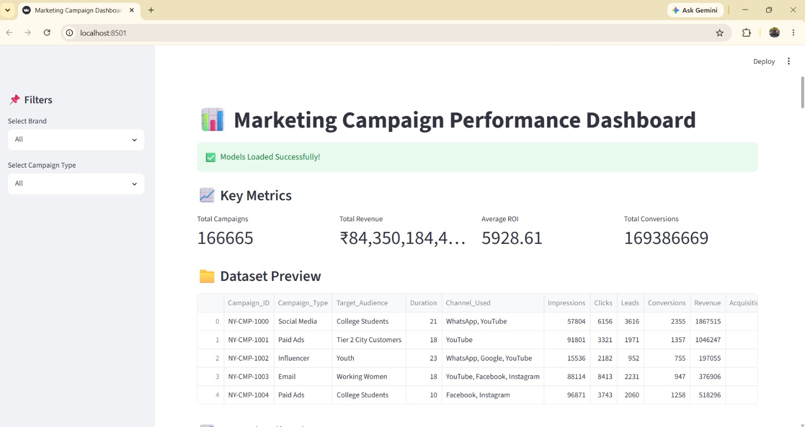
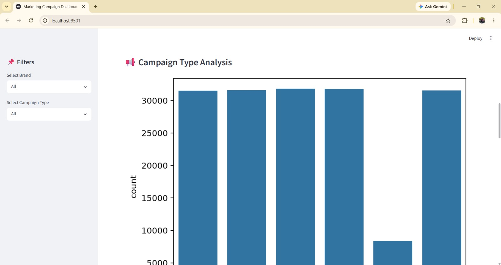
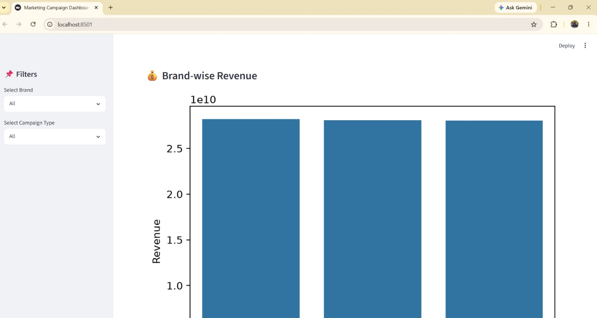
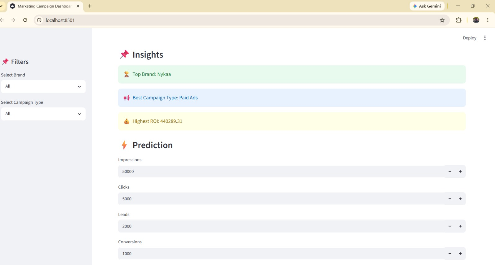
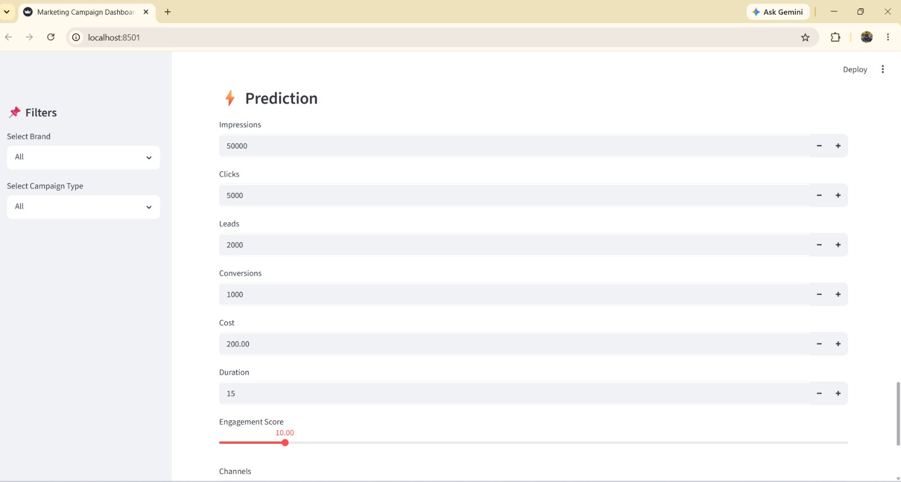
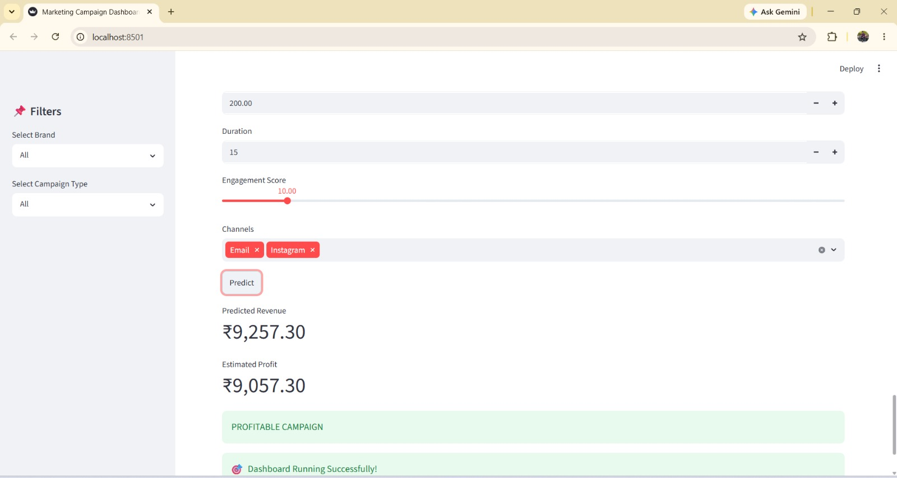

# 📊 Multi-Brand Marketing Campaign Performance Analysis & Prediction

An end-to-end data analytics and machine learning project analyzing marketing campaign performance across three beauty brands — **Nykaa, Purplle, and Tira** — from raw CSV data through EDA and ML modeling to an interactive Streamlit dashboard with a live prediction module.



---

## 📌 Project Overview

Marketing teams across multiple brands generate large volumes of raw campaign data — impressions, clicks, conversions, acquisition cost, revenue. This project turns that raw data into a structured analytics pipeline: cleaning and feature engineering in a Jupyter notebook, two trained ML models (revenue regression + profitability classification), and a Streamlit dashboard that surfaces KPIs, visual analytics, and instant campaign predictions.

---

## 🚀 Key Features

**Data Analytics**
- Multi-brand campaign merge (Nykaa, Purplle, Tira)
- Missing value handling, duplicate removal
- Exploratory Data Analysis (EDA)

**Feature Engineering**
- ROI calculation
- Profit/Loss flag creation
- Multi-label channel encoding, categorical label encoding

**Machine Learning**
- Random Forest Regressor → Revenue prediction
- Random Forest Classifier → Profit/Loss prediction
- Trained and evaluated in `notebooks/marketing_analysis.ipynb`

**Interactive Dashboard**
- Brand & campaign-type filters
- KPI metrics: Total Campaigns, Total Revenue, Average ROI, Total Conversions
- ROI distribution, campaign type analysis, brand-wise revenue charts
- Business insights panel: top brand, best campaign type, highest ROI
- Instant prediction module: revenue, estimated profit, and profitability status from user inputs

---

## 📸 Screenshots

**Dashboard Overview — KPIs & Dataset Preview**


**Campaign Type Analysis**


**Brand-wise Revenue**


**Business Insights Panel**


**Revenue & Profitability Prediction**



---

## 🛠 Tech Stack

Python · Pandas · NumPy · Scikit-Learn · Matplotlib · Seaborn · Streamlit · Pickle

---

## 📁 Project Structure

```
Marketing-Campaign-Performance-Analysis/
├── data/
│   ├── nykaa_campaign_data_with_nulls.csv
│   ├── purplle_campaign_data_with_nulls.csv
│   └── tira_campaign_data_with_nulls.csv
├── notebooks/
│   ├── marketing_analysis.ipynb
│   └── models/
│       ├── reg_model.pkl
│       ├── reg_columns.pkl
│       ├── clf_model.pkl
│       ├── clf_columns.pkl
│       ├── mlb_encoder.pkl
│       └── label_encoders.pkl
├── screenshots/
│   ├── dashboard_overview.jpeg
│   ├── campaign_type_analysis.jpeg
│   ├── brand_wise_revenue.jpeg
│   ├── insights_panel.jpeg
│   ├── prediction_inputs.jpeg
│   └── prediction_result.jpeg
├── docs/
│   ├── Marketing_Campaign_Presentation.pptx
│   └── Marketing_Campaign_Report.pdf
├── app.py
├── requirements.txt
├── .gitignore
└── README.md
```

> ⚠️ **Note on model files:** `reg_model.pkl` is large (500+ MB, an unpruned Random Forest Regressor) and exceeds GitHub's file size limits, so it is **not included in this repository**. To reproduce it, run `notebooks/marketing_analysis.ipynb` end-to-end — it will regenerate all six files in `notebooks/models/`. The dashboard (`app.py`) expects the models at that exact path.

---

## ⚙️ How to Run

**1. Clone the repository**
```bash
git clone https://github.com/meetthaheerhere-ds/Marketing-Campaign-Performance-Analysis.git
cd Marketing-Campaign-Performance-Analysis
```

**2. Install dependencies**
```bash
pip install -r requirements.txt
```

**3. Generate the model files**

Run `notebooks/marketing_analysis.ipynb` top to bottom in Jupyter. This trains both models and saves the six `.pkl` files into `notebooks/models/` (required, since `reg_model.pkl` isn't shipped in the repo due to size).

**4. Launch the dashboard**
```bash
streamlit run app.py
```

---

## 📈 Key Insights

- Campaign ROI varies significantly across brands, with certain channels consistently outperforming others
- A subset of campaign types drives a disproportionate share of total revenue
- Random Forest models were used for both revenue prediction (regression) and profitability prediction (classification)

*(Add 2-3 concrete numbers from your notebook here — e.g. the actual top-performing channel or campaign type by revenue.)*

---

## 🎯 Project Outcome

- Built a complete EDA-to-deployment pipeline for multi-brand campaign data
- Trained and evaluated regression and classification models for revenue and profitability
- Developed an interactive Streamlit dashboard with filters, visual analytics, and live predictions

---

## 📌 Future Enhancements

- Deploy on Streamlit Community Cloud and link the live demo above
- Review the classification and regression feature sets for potential data leakage (e.g. features directly derived from the prediction target) to ensure evaluation metrics reflect genuine model performance
- Reduce `reg_model.pkl` size (e.g. via `max_depth`/`min_samples_leaf` constraints or compressed serialization) so it can be committed directly to the repo
- Add a correlation heatmap and SQL-style query explorer to the dashboard itself (currently only in the notebook)

---

## 👨‍💻 Author

Thaheer

